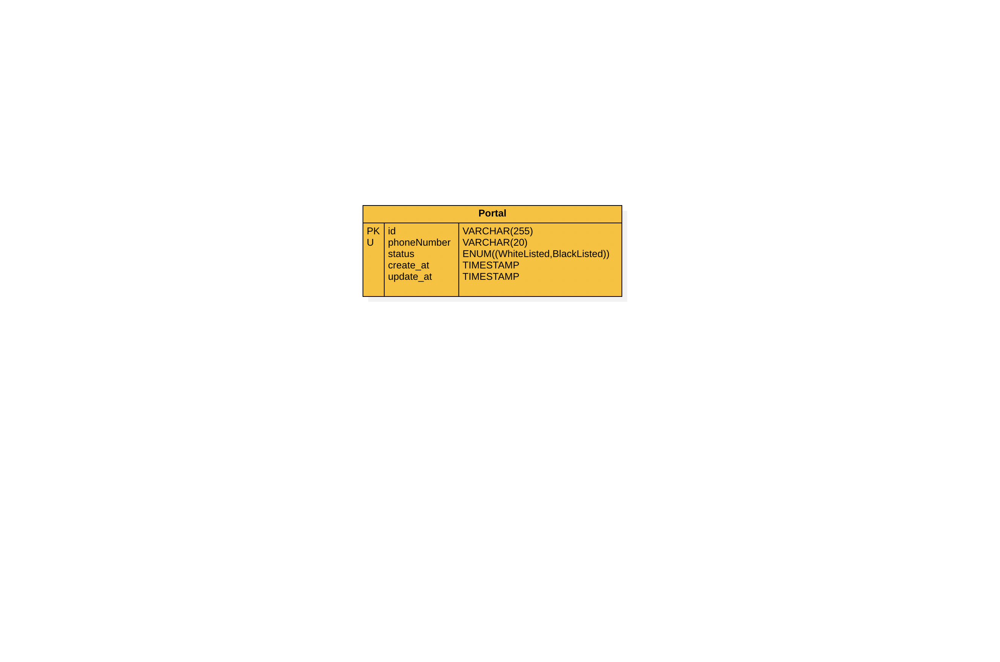
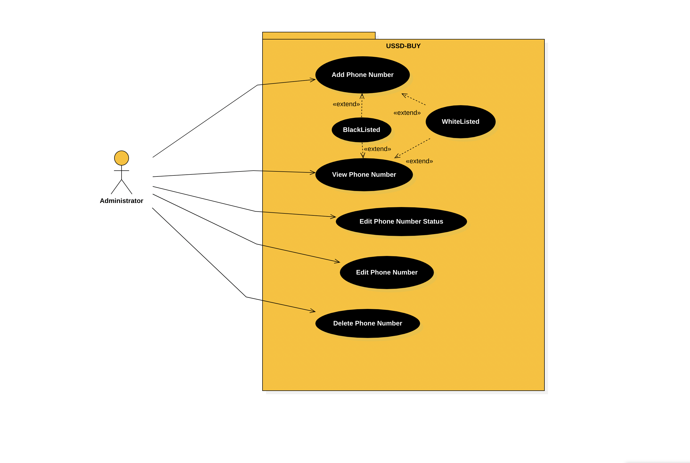
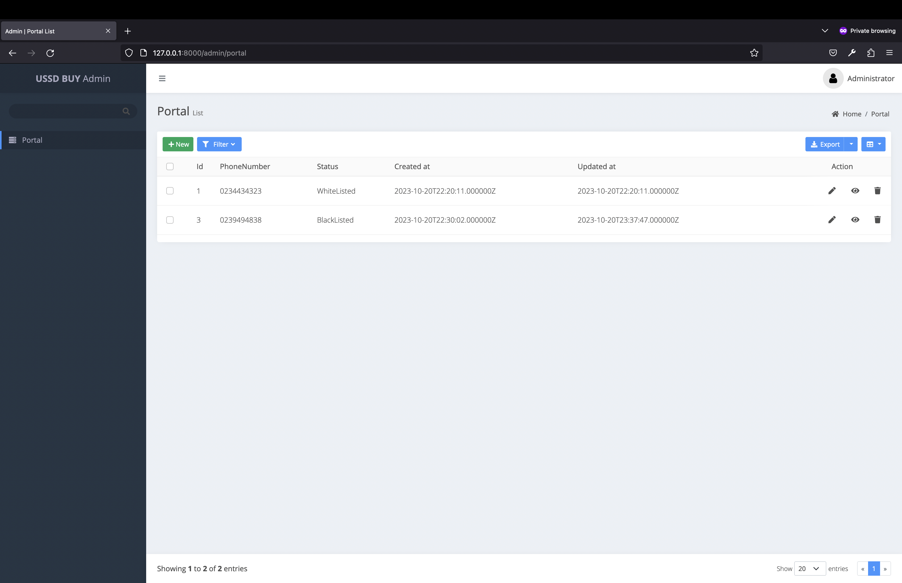
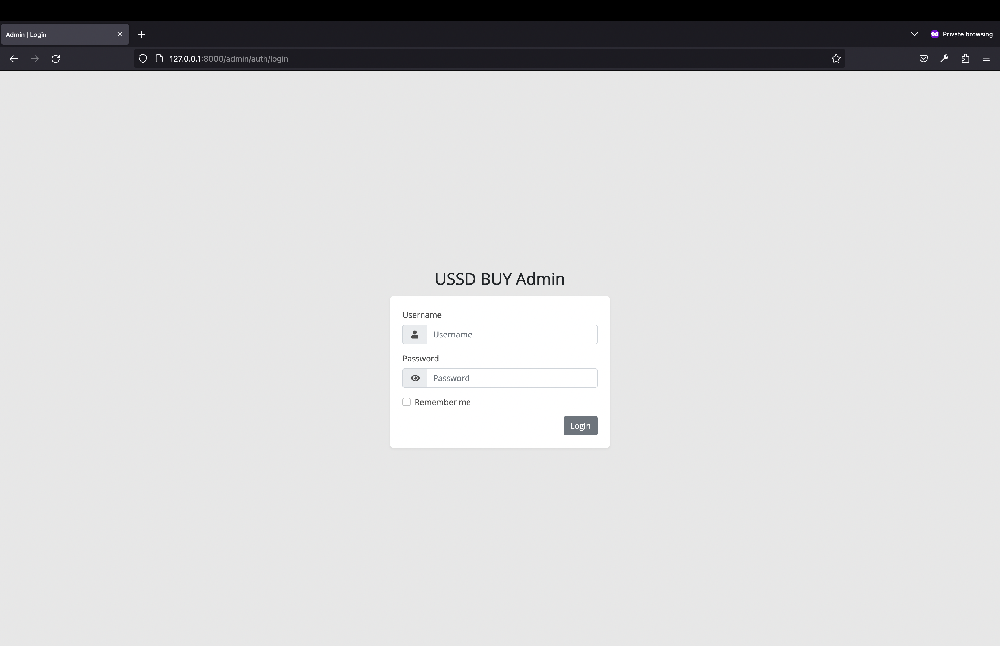
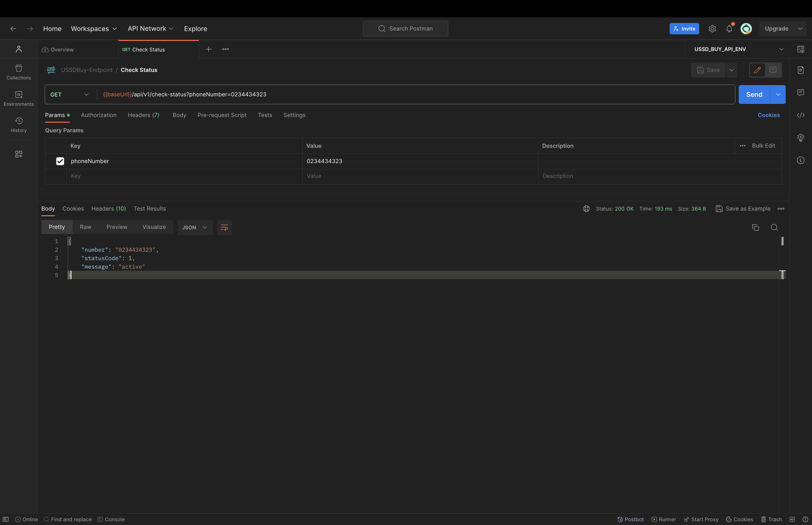

## About USSDBuy

A simple admin portal developed with the Laravel PHP Framework that allows admin to
Add a new number and whitelist it
- View all numbers added to the portal
- Edit number
- Delete number
- Blacklist number

## Software Requirements
- PHP >= 8.1.0 or latest

## How to install software
- Install composer on your local machine
- Git clone project 
- Open command line or terminal and change directory to project using `cd ussd-buy`
- Create a dot evn `.env` file in the project
- Copy the content of `.env.examples` into the `.env`
- Set your database user and password in the `.env` file
- Enter the command `composer install` to install all dependencies
- Enter the command `php artisan migrate` to migrate schemas
- Enter the command `php artisan db:seed --class=DatabaseSeeder" to populate the database tables with administrative credentials
- Finally, enter the command `php artisan serve` to run project, copy the url in your command line or terminal run it your favorite browser

## Admin Credentials
- Username: `admin`
- Password: `admin`

## How To Test API

- The directory named `postman-collection` contains two files `USSD_BUY_API_ENV.postman_environment.json` and `USSDBuy-Endpoint.postman_collection.json`
- `USSD_BUY_API_ENV.postman_environment.json` contains the environment variables of the collection `USSDBuy-Endpoint.postman_collection.json`
- Import both files in postman.
- After importing set the collection environment to `USSD_BUY_API_ENV` and test

## Feature Testing
- Project contains feature test in the tests/feature/USSDBuyTest.php
- To run feature test use this command `php artisan test`

## ER DIAGRAM

    
</a>

## USE CASE DIAGRAM

    
</a>

## UI Screen Shots

    
</a>

    
</a>

## API TEST Screen Shots

    
</a>

    
</a>

## Other Info
- You can verify project's scrum board using this link [USSD-BUY AGILE BOARD](https://trello.com/invite/b/7offekwM/ATTI1eb78df1a48a837f4239ee5b4b89be9eACEBA54C/ussd-buy)